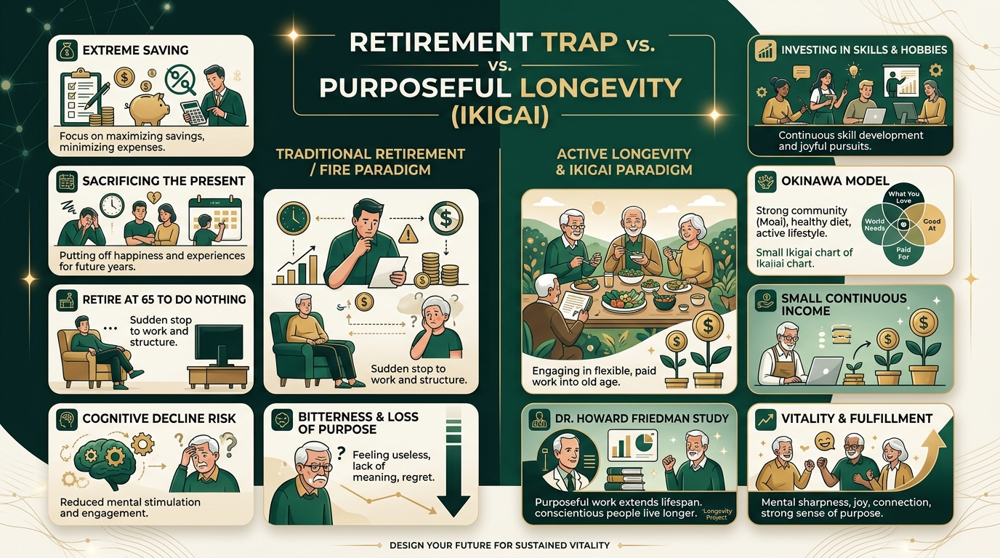

---
tags:
  - inversión
  - productividad
  - desarrollo-personal
  - longevidad
  - hábitos
---

# Gana Dinero, Jubílate y Fracasa: La Trampa de la Jubilación y el Modelo de Longevidad Activa

Muchas personas siguen al pie de la letra las reglas clásicas de finanzas personales: ahorran con disciplina, invierten rigurosamente cada mes y aplican el principio de *«págate a ti mismo primero»*. Sin embargo, cuando llega el fin de semana y quieren gastar dinero en sus pasatiempos, comprar un libro o invertir en un proyecto personal, sienten una punzada de culpa.

Esa culpa surge de una premisa errónea: asumir que el objetivo final de la vida financiera es acumular una masa ingente de dinero para **dejar de trabajar por completo a los 65 años y no hacer nada durante décadas**.

En esta reflexión, basada en la ponencia de **Natanael Arata** (*Arata Academy*), se desmonta el mito de la jubilación pasiva a través de la ciencia del envejecimiento, el modelo de longevidad de Okinawa y una nueva forma de enfocar el ahorro y los proyectos vitales.

---

## 📊 Infografía resumen: Trampa de la jubilación vs. Longevidad activa

---

## 📺 Vídeo completo

<iframe width="100%" height="480" style="max-width:100%;border:1px solid #ccc;border-radius:8px;margin:.5rem 0;" src="https://www.youtube-nocookie.com/embed/_6KuWl5tomE" title="Gana Dinero. Jubílate. Fracasa." frameborder="0" allow="accelerometer; autoplay; clipboard-write; encrypted-media; gyroscope; picture-in-picture; web-share" referrerpolicy="strict-origin-when-cross-origin" allowfullscreen></iframe>

*Vídeo original: «Gana Dinero. Jubílate. Fracasa.» — Arata Academy.*

---

## La trampa de financiar a un «tú futuro» inactivo

Cuando tu único horizonte es la jubilación tradicional, caes en un patrón psicológico destructivo:

1. **El trabajo como prisión:** Tu ocupación actual se convierte en una condena de la que hay que escapar lo antes posible.
2. **Culpa en el presente:** Cada euro o cada hora invertida hoy en aficiones, herramientas, formación o disfrute personal parece un obstáculo que retrasa tu día de liberación.
3. **El sacrificio innecesario:** Te niegas recursos a ti mismo en el presente para financiar a una versión futura que permanecerá sentada en el sofá sin metas ni responsabilidades.

> **Paradoja:** Ahorrar obsesivamente para dejar de trabajar puede matar las mismas actividades y habilidades que le darían sentido a tu vida cuando envejezcas.

---

## La lección de Okinawa (Zonas Azules) y el concepto de Ikigai

En las regiones conocidas como **Zonas Azules** (famosas mundialmente por concentrar a las poblaciones más longevas y saludables del planeta), la relación con el trabajo es radicalmente distinta.

En **Okinawa (Japón)**, en el idioma tradicional ni siquiera existe una palabra para definir la jubilación occidental (*dejar de trabajar para siempre*). Los ancianos:

- Mantienen una segunda actividad: cuidan pequeños huertos locales, elaboran artesanías o participan activamente en asociaciones comunitarias (*Moai*).
- **No trabajan por supervivencia económica:** Cuentan con ahorros suficientes para detenerse, pero continúan en marcha porque mantenerse activos les aporta alegría, contacto social y un motivo para levantarse cada mañana (**Ikigai**).

---

## La evidencia científica: El estudio de longevidad del Dr. Howard Friedman

Existe la creencia popular de que el trabajo desgasta y enferma, y que el descanso absoluto es la clave de la salud. Sin embargo, la evidencia científica demuestra exactamente lo contrario.

El **Dr. Howard Friedman**, en su célebre investigación de más de 80 años de seguimiento a más de 1.000 personas (*The Longevity Project*), buscó identificar los factores reales que determinaban una vida larga y lúcida. El hallazgo fue revelador:

- **Los más longevos no fueron quienes se retiraron temprano a descansar.**
- Las personas con mayor esperanza de vida y vitalidad fueron aquellas que **se mantuvieron comprometidas con un trabajo significativo, resolviendo problemas reales y aportando valor a su comunidad** a lo largo de toda su vida.

Mantenerse activo no significa sufrir agotamiento (*burnout*) ni encadenarse a un empleo que detestas; significa conservar una ocupación estimulante que preserve tu agudeza mental, tu red social y tu sensación de logro.

---

## La matemática del ahorro: Reducir la meta con ingresos activos

Las calculadoras tradicionales de independencia financiera (movimiento FIRE) asumen una premisa muy exigente: **necesitas acumular un capital suficiente para cubrir 30 o 40 años con CERO ingresos activos**. Esto obliga a ahorrar sumas exorbitantes y a vivir con privaciones severas en los mejores años de juventud.

| Enfoque | Premisa de ingresos en la vejez | Capital requerido | Impacto psicológico |
| :--- | :--- | :--- | :--- |
| **Jubilación Tradicional / FIRE clásico** | 0 € de ingresos activos durante décadas. | Muy elevado (x25 o x30 del gasto anual). | Obsesión por ahorrar, privación presente y riesgo de vacío existencial. |
| **Longevidad Activa / Modelo Ikigai** | Pequeño flujo de ingresos derivado de proyectos o pasatiempos disfrutables. | **Mucho menor**. | Disfrute e inversión en pasiones actuales sin culpa; envejecimiento vital. |

Si en lugar de cero ingresos asumes que en tu madurez generarás un ingreso complementario moderado vendiendo consultoría ligera, impartiendo clases, cuidando un proyecto digital o comercializando tus creaciones, **la meta de ahorro se reduce drásticamente**, liberando margen financiero para disfrutar hoy.

---

## Ejemplos de mentalidad activa

- **El pintor Katsushika Hokusai:** A los 73 años declaró públicamente que todo lo que había dibujado antes no valía la pena y que su verdadera carrera como artista estaba recién comenzando. Su anhelo no era contar los días para retirarse, sino llegar a los 80 o 90 años perfeccionando su trazo.
- **Osamu Tezuka (creador del manga moderno):** En 1989, hospitalizado en sus últimos días de vida, continuaba dibujando sobre una tabla portátil. Cuando la enfermera intentó retirarle los lápices para que «descansara», suplicó: *«Por favor, déjame trabajar»*. Para él, su arte era su vida.

---

## Conclusión: Construye una vida que nunca quieras abandonar

Invertir dinero hoy en libros, herramientas, habilidades o viajes no es un despilfarro frente a tu jubilación. Es la inversión directa en construir la energía, la identidad y las capacidades que te mantendrán activo, lúcido y útil durante toda tu existencia.

> **Cambio de paradigma:** Deja de ahorrar dinero únicamente para el día en que dejes de trabajar. Comienza a usar tu dinero hoy para construir una vida que jamás sientas la necesidad de abandonar.
