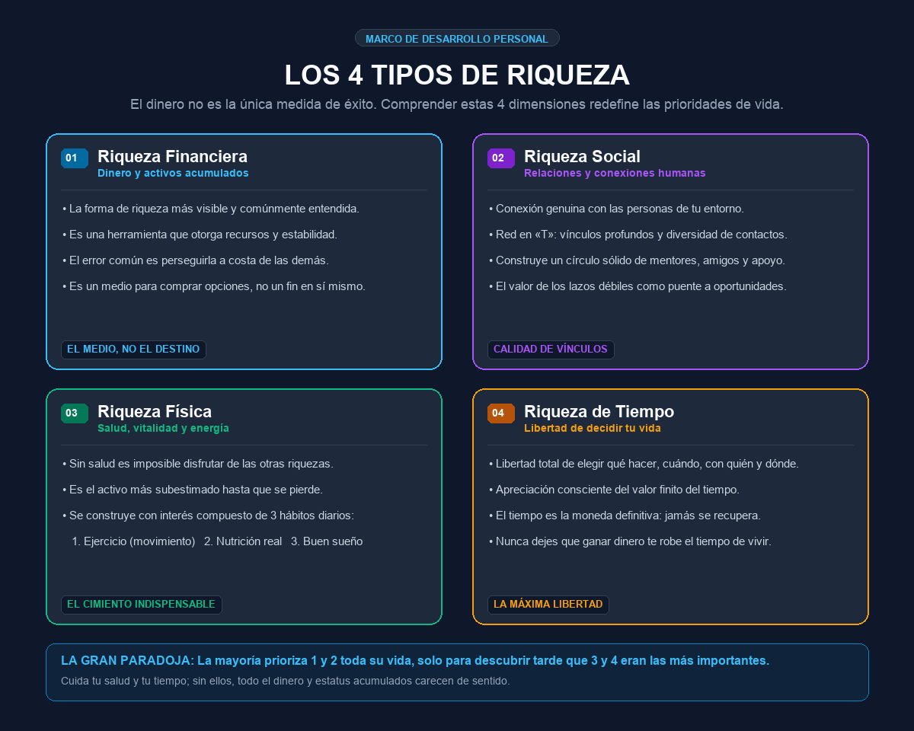

---
tags:
  - inversión
  - productividad
  - finanzas
  - desarrollo-personal
---

# Los 4 tipos de riqueza

Nos han enseñado habitualmente que el dinero es el único tipo de riqueza. Sin embargo, reducir el éxito a una sola métrica material es un error que suele costar caro con el paso de los años. Existen cuatro dimensiones fundamentales de la riqueza que es indispensable comprender y equilibrar para vivir con plenitud.

---

## 📊 Infografía resumen

---

## Las 4 dimensiones de la riqueza

### 1. 💰 Riqueza Financiera (Dinero y activos)
Es la forma de riqueza más evidente y comúnmente entendida; lo que la mayoría de la gente imagina cuando piensa en alguien «rico».

- Consiste en el dinero, inversiones y activos materiales acumulados.
- **Su verdadero valor:** Actúa como una herramienta para obtener estabilidad y comprar opciones, pero no es el fin último en sí mismo. Perseguirla sacrificando la salud o las relaciones destruye las demás riquezas.

### 2. 🤝 Riqueza Social (Relaciones y conexiones)
Representa la calidad y profundidad de nuestros vínculos con los demás en nuestro entorno personal y profesional.

- **Red en «T»:** Desarrollar conexiones amplias (lazos débiles que abren puertas a nuevas ideas y oportunidades) y vínculos estrechos y profundos con mentores, amigos de confianza y familia.
- Rodearse de personas que eleven tus estándares, aporten apoyo mutuo y compartan tus valores fundamentales.

### 3. 🏃 Riqueza Física (Salud, vitalidad y energía)
Es la dimensión más crítica y paradójicamente la más descuidada hasta que falla.

- **El cimiento indispensable:** Sin salud y vitalidad física, es prácticamente imposible disfrutar de los beneficios de cualquiera de los otros tres tipos de riqueza.
- Se construye mediante el interés compuesto de tres hábitos diarios no negociables:
  1. **Ejercicio y movimiento diario:** Mantener el cuerpo activo y fuerte.
  2. **Nutrición de calidad:** Basada principalmente en comida real y no procesada.
  3. **Descanso y sueño reparador:** Respetar los ritmos circadianos y horas de sueño de calidad.
- Nunca es tarde para empezar a construir o recuperar la riqueza física.

### 4. ⏳ Riqueza de Tiempo (Libertad y autonomía)
Es la capacidad de decidir libremente sobre el recurso más escaso e irrecuperable que poseemos.

- **La libertad de elegir:**
  - Cómo pasas tu tiempo.
  - Con quién decides compartirlo.
  - En qué lugar decides estar.
  - Cuándo decides intercambiar tiempo por otros recursos.
- **La moneda definitiva:** El tiempo es tu único recurso verdaderamente finito; una vez consumido, jamás se recupera.

---

## 💡 La gran paradoja de la vida

La inmensa mayoría de las personas pasa su juventud y madurez priorizando casi exclusivamente la **riqueza financiera (1)** y el **estatus social (2)**, solo para descubrir en la etapa madura o al final de la vida que la **riqueza física (3)** y la **riqueza de tiempo (4)** eran, por mucho, las más valiosas e indispensables.

!!! tip "Principio de equilibrio"
    Jamás permitas que la búsqueda de riqueza financiera te robe tu salud física ni el tiempo para vivir lo que realmente importa.

---

**Fuente:** [Growth Labs (@growthhub_ en X)](https://x.com/growthhub_/status/1819780874445164886)
