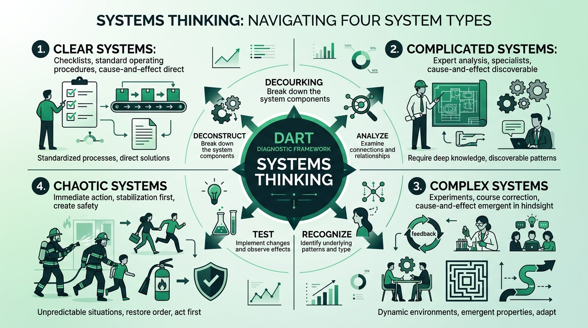

---
tags:
  - productividad
  - educación
  - pensamiento-crítico
  - toma-de-decisiones
---

# Pensamiento Sistémico y el Framework DART: Cómo pensar con claridad y tomar mejores decisiones

A menudo, personas muy inteligentes cometen errores sumamente caros. Decisiones de carrera equivocadas, malas adquisiciones corporativas o rupturas personales no suelen producirse por falta de inteligencia o de buenas intenciones, sino por operar con un **modelo mental erróneo del sistema** en el que se encuentran.

El **pensamiento sistémico** (*systems thinking*) es la habilidad de detectar los patrones ocultos y la estructura de interconexiones antes de actuar. En un entorno donde la inteligencia artificial automatiza tareas analíticas a gran velocidad, la capacidad de diagnosticar sistemas complejos se convierte en una ventaja cognitiva indispensable.

Este marco de trabajo, sintetizado por **Sandeep Swadia** (ex-monje, ex-director de operaciones y consejero en empresas multimillonarias), desglosa la anatomía de los sistemas, sus trampas habituales y un método práctico de diagnóstico: el **Framework DART**.

---

## 📊 Infografía resumen: Tipos de sistemas y Modelo DART

---

## 📺 Vídeo completo

<iframe width="100%" height="480" style="max-width:100%;border:1px solid #ccc;border-radius:8px;margin:.5rem 0;" src="https://www.youtube-nocookie.com/embed/mjTgkm-h__M" title="How To Think SO Clearly People Assume You're Brilliant" frameborder="0" allow="accelerometer; autoplay; clipboard-write; encrypted-media; gyroscope; picture-in-picture; web-share" referrerpolicy="strict-origin-when-cross-origin" allowfullscreen></iframe>

*Vídeo original: «How To Think SO Clearly People Assume You're Brilliant» — Sandeep Swadia.*

---

## ¿Qué es exactamente un sistema?

La definición más operativa de un sistema es: **un conjunto de partes interconectadas que producen un patrón recurrente**.

- **Partes:** Los elementos observables (por ejemplo, en una cafetería: clientes, menú, cajero, barista, máquina de espresso).
- **Conexiones:** Las reglas e intercambios que vinculan las partes (el flujo de pedidos y cobro).
- **Patrones:** Los resultados y comportamientos continuos que emergen del funcionamiento conjunto.

Tu empresa es un sistema, tu carrera es un sistema, tu salud es un sistema y tu pareja es un sistema. Para pensar sistémicamente, ante cualquier situación debes hacerte tres preguntas fundamentales sobre lo que no se ve a simple vista:

1. ¿Cuáles son las partes ocultas?
2. ¿Cómo están conectadas entre sí?
3. ¿Qué patrones se repiten de forma constante?

---

## Las 3 trampas comunes al lidiar con sistemas

La mayoría de los errores graves ocurren por caer en una de estas tres distorsiones:

### 1. Desconocer el tipo de sistema
Existen cuatro naturalezas de sistemas distintas. Aplicar la solución de un sistema claro a un problema complejo (por ejemplo, pretender educar a un hijo adolescente usando un manual de instrucciones o una lista de tareas) garantiza el fracaso.

### 2. El Efecto Cobra (la trampa del incentivo perverso)
A principios del siglo XX, las autoridades coloniales británicas en Delhi querían erradicar la sobrepoblación de cobras venenosas. Diseñaron una recompensa económica por cada cobra muerta entregada. El resultado fue contraproducente: los ciudadanos comenzaron a criar cobras en granjas para sacrificarlas y cobrar más recompensas. Al cancelarse el programa, los criadores liberaron miles de serpientes, duplicando la plaga original.

> **Regla de oro:** Cuando asignas un incentivo a la métrica equivocada, las personas optimizarán el sistema para maximizar la recompensa, destruyendo el propósito original para el que fue creado.

### 3. Bucles de retroalimentación diferidos (*delayed feedback loops*)
En muchos sistemas, la acción se toma en el presente pero las consecuencias permanecen invisibles durante meses o décadas. El ejemplo clásico es el consumo de tabaco en el siglo XX: el alivio y la satisfacción química llegan en segundos; el daño celular severo aparece décadas después. Cuando la retroalimentación está demorada, es fácil convencerse de que no existe peligro ni coste alguno.

---

## Los 4 tipos de sistemas y cómo actuar en cada uno

El marco clasifica la realidad en cuatro entornos operativos:

### 1. Sistemas Claros (Clear Systems)
- **Naturaleza:** La relación entre causa y efecto es directa, evidente y predecible. Si sigues los pasos fijados, obtienes el resultado esperado.
- **Protocolo de actuación:** No improvises ni busques ser original. Sigue el proceso con rigurosa precisión.
- **Herramienta clave:** Las **listas de verificación (*checklists*)**. Pilotos de aviación y cirujanos las emplean no por falta de habilidad, sino para blindarse contra el error humano involuntario.
- **El caso de Van Halen y los M&M's marrones:** El grupo musical incluía en su contrato técnico de 400 páginas una cláusula que exigía un cuenco de M&M's entre bastidores sin ningún caramelo marrón. Si al llegar veían un M&M marrón, sabían al instante que los organizadores no habían leído con rigor las especificaciones técnicas ni los protocolos de seguridad eléctrica del escenario.

### 2. Sistemas Complicados (Complicated Systems)
- **Naturaleza:** La relación causa-efecto existe de manera determinista, pero no es obvia a simple vista; se encuentra oculta bajo múltiples capas técnicas.
- **Protocolo de actuación:** Frena el ritmo, profundiza en el análisis o acude al **especialista idóneo**.
- **Ejemplos:** Un paciente con dolor agudo en el pecho (síntoma único con más de 20 causas posibles, algunas letales en 60 minutos), el diseño de una hipoteca estructural, una auditoría fiscal o la arquitectura de un software empresarial.

### 3. Sistemas Complejos (Complex Systems)
- **Naturaleza:** Los elementos interactúan de forma dinámica y no lineal. Cualquier intervención altera el propio entorno. La causa y el efecto solo se comprenden verdaderamente **en retrospectiva (*in hindsight*)**.
- **Protocolo de actuación:** Es imposible predecir el desenlace exacto sobre el papel. Lanza **pequeños experimentos reversibles**, observa la respuesta del entorno y corrige el rumbo en tiempo real. Busca estar en la dirección correcta en lugar de obsesionarte con una falsa precisión inicial.
- **Ejemplos:** Integración cultural tras la fusión de dos empresas, mercados financieros volátiles o la crianza de los hijos.

### 4. Sistemas Caóticos (Chaotic Systems)
- **Naturaleza:** El vínculo entre causas y efectos se ha fracturado o es desconocido. Hay una crisis súbita con información fragmentada y cambiante.
- **Protocolo de actuación:** **Actúa primero, estabiliza la situación y analiza después.** El error mortal en el caos es la *parálisis por análisis*. Hay que contener el daño y establecer un perímetro de seguridad antes de indagar en las explicaciones.
- **El caso de Tylenol (Johnson & Johnson, 1982):** Tras registrarse muertes súbitas en Chicago provocadas por cápsulas envenenadas con cianuro, la dirección no esperó a investigar o consultar comités: retiró de inmediato 31 millones de envases en todo el país. Estabilizaron primero; entendieron después.

---

## El Framework DART: Diagnóstico en 4 pasos

Para no confundir el sistema en el que estás operando, aplica el acrónimo **DART**:

| Fase | Acción | Pregunta diagnóstica |
| :--- | :--- | :--- |
| **D** – *Deconstruct* (Descomponer) | Desarmar el problema en sus componentes esenciales. | ¿Las partes del sistema son estables y fijas o cambian constantemente? |
| **A** – *Analyze* (Analizar) | Evaluar el vínculo entre causa y efecto. | ¿Es obvio (Claro), requiere estudio técnico (Complicado), emerge con el tiempo (Complejo) o está roto (Caótico)? |
| **R** – *Recognize* (Reconocer) | Buscar paralelismos y patrones recurrentes. | ¿He visto una dinámica parecida antes en este sector o en otra disciplina ajena? |
| **T** – *Test* (Probar) | Diseñar la intervención mínima viable. | ¿Cuál es el test más pequeño y de menor riesgo que puedo ejecutar antes de comprometer grandes recursos? *(En caos no hay test: se estabiliza de inmediato)*. |

---

## El «Efecto del Andén»: Cómo salir de tu propio sistema

Cuando estás sentado dentro de un tren en la estación y el tren de la vía de al lado empieza a moverse despacio, tu cerebro siente que eres tú quien se desplaza. Desde el interior, ambas sensaciones son idénticas; solo quien está de pie en el andén distingue con claridad cuál de los dos trenes avanza.

Estando inmerso en tu propio sistema (tu trabajo, tu relación o tu rutina), pierdes la perspectiva. Para situarte en el «andén», recurre a tres palancas:

1. **Mentores:** Personas externas cualificadas que no tienen intereses creados en tu historia y pueden evaluar tu trayectoria con objetividad fría.
2. **Datos objetivos:** Los números no se dejan influir por tus narrativas de consuelo ni por tus sesgos. El dato mide lo que el sistema hace en realidad, no lo que crees que hace.
3. **Perspectiva temporal:** Compara periódicamente tus resultados y hábitos con los de hace doce meses, tres meses o una semana para verificar la dirección real del avance.

---

## Romper falsas dicotomías y el sistema mental interno

El mundo empresarial suele plantear elecciones binarias: o construyes un **Ferrari** (producto exclusivo, de lujo y margen alto, pero volumen reducido) o construyes un **Toyota** (fabricación masiva a bajo coste y margen ajustado).

Muchas de estas disyuntivas no son límites de la realidad física, sino **límites en el diseño del sistema**. Compañías como Apple rompieron esa dicotomía produciendo cientos de millones de iPhones con estándares de acabado prémium a un ritmo industrial de más de 300 unidades por minuto: combinaron el modelo de lujo con la escala masiva gracias a un sistema logístico y de ingeniería sin precedentes.

El sistema más complejo y decisivo que tendrás que rediseñar jamás es **tu propia mente**: las creencias asumidas, los límites autoimpuestos y la historia que te cuentas a diario. Al igual que cualquier otro sistema, puede ser diagnosticado, desarmado y transformado por completo.
