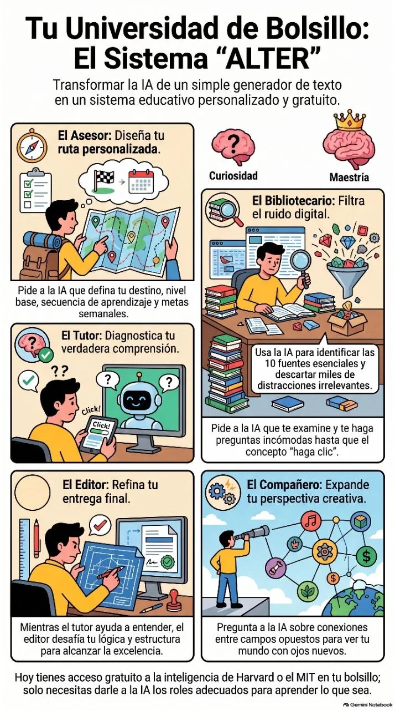

# El Sistema "University in a Box" y el framework ALTER

La inteligencia artificial te permite construir tu propia "universidad en una caja" ("University in a Box") de manera gratuita, ayudándote a convertirte en un experto autodidacta en casi cualquier tema. Este sistema busca solucionar un gran problema actual: aunque las mejores universidades del mundo ofrecen cursos gratuitos en línea, cerca del 88% de las personas que los inician nunca los terminan.

Para que la autoeducación con IA sea verdaderamente efectiva, debes dejar de tratarla como un simple generador de texto y convertirla en un motor de inteligencia, asignándole cinco roles radicales que conforman el acrónimo ALTER:

- **A - Asesor (Advisor):** Es el punto de partida. Un buen asesor construye un plan de estudios y un camino personalizado para ti. Para configurarlo, debes pedirle a la IA que defina cinco elementos: tu destino (qué quieres saber al final), tu línea base (cuál es tu nivel actual), la secuencia correcta de aprendizaje, una lista de cosas que debes ignorar por ahora, y los hitos o pruebas que demostrarán que has dominado el tema.
- **L - Bibliotecario (Librarian):** Su función principal es defender tu plan de estudios de las distracciones. El internet y los algoritmos buscan retener tu atención, no enseñarte, por lo que el bibliotecario de IA (usando herramientas como NotebookLM) filtra el "ruido", selecciona fuentes creíbles y ancla tu aprendizaje a documentos reales y confiables.
- **T - Tutor (Tutor):** A diferencia de un profesor que solo explica, un tutor diagnostica tu confusión específica uno a uno. Históricamente, la tutoría personalizada hace que el estudiante rinda mejor que el 98% del resto de una clase convencional (el "problema 2 sigma" de Benjamin Bloom). Puedes usar el modo de voz de la IA para que te haga preguntas incómodas y no te deje avanzar hasta que el concepto realmente haga clic en tu mente.
- **E - Editor (Editor):** La excelencia vive en la retroalimentación. Cuando necesites entregar un trabajo o proyecto, la IA actúa como tu editor para revisar tu trabajo, desafiar tu lógica, encontrar debilidades en tus argumentos, eliminar repeticiones y hacer tu estructura mucho más precisa.
- **R - Compañero de cuarto (Roommate):** En el futuro, necesitarás amplitud de conocimientos, y esto viene de tu "compañero de cuarto". Este rol de la IA te ofrece perspectivas frescas sobre temas que están completamente fuera de tu campo (por ejemplo, conectar la forma en que un músico de jazz toca con la construcción de equipos empresariales). Te entrega una lente distinta para cruzar ideas y hacer preguntas que nunca te harías por ti mismo.

## Infografía: El Sistema ALTER

## Vídeo explicativo

<video controls preload="metadata" style="max-width:100%;border:1px solid #ccc;border-radius:8px;" src="../video/notebooklm.mp4"></video>

*Hoy tienes acceso gratuito a la inteligencia de Harvard o el MIT en tu bolsillo; solo necesitas darle a la IA los roles adecuados para aprender lo que sea.*
