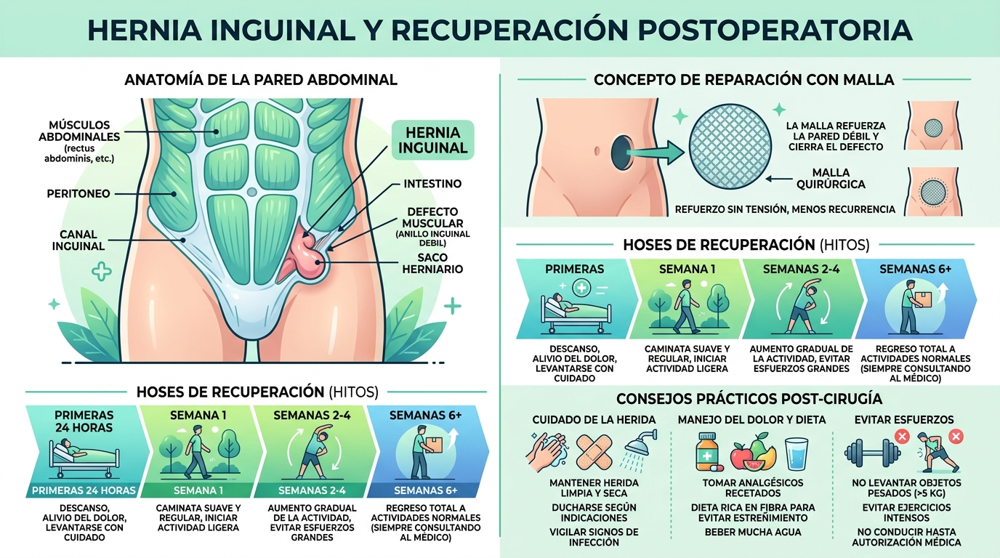

---
tags:
  - salud
  - cirugia
  - hernia
  - recuperacion
  - podcast
---

# Operación de hernia inguinal: qué esperar, cirugía con malla y guía real de recuperación

Guía práctica y basada en la experiencia real sobre el diagnóstico, la intervención quirúrgica con malla y el postoperatorio de una **hernia inguinal**. Un repaso detallado a todo lo que ocurre desde los primeros síntomas hasta los cuidados cotidianos en casa: manejo del dolor, problemas de movilidad, gases, digestión y recomendaciones que rara vez se explican antes de pasar por quirófano.

---

## 🎙️ Podcast: Experiencia real contada en primera persona

Escucha el episodio completo del podcast de **El Mosquetero Web** con todos los detalles del proceso quirúrgico y la recuperación:

<audio controls preload="metadata" style="width: 100%; border-radius: 8px; margin: 1em 0;">
  <source src="../audio/podcast-hernia-inguinal-experiencia-recuperacion.mp3" type="audio/mpeg">
  Tu navegador no soporta el elemento de audio.
</audio>

---

## 📊 Infografía resumen: Anatomía, malla y fases de recuperación

---

## 🩺 ¿Qué es una hernia inguinal y por qué aparece?

Una **hernia inguinal** se produce cuando una porción del tejido intraabdominal (habitualmente grasa preperitoneal o un asa del intestino delgado) protruye hacia el exterior a través de una zona de debilidad en la fascia o musculatura de la pared abdominal baja, a nivel del canal inguinal.

* **Frecuencia:** Es una patología muy común en adultos, afectando predominantemente a hombres (especialmente a partir de los 50 años por la degeneración natural del tejido conectivo), aunque puede aparecer a cualquier edad y también en mujeres.
* **Evolución:** Las hernias no remiten por sí solas ni curan con ejercicio. Tienden a aumentar de tamaño con el tiempo debido a la presión intraabdominal continua (caminar, toser, levantar peso).
* **Solución definitiva:** La intervención quirúrgica es el único tratamiento resolutivo para evitar complicaciones mayores como la incarceración (la hernia queda atrapada) o el estrangulamiento (pérdida de riego sanguíneo en el tejido herniado).

---

## 🔍 Primeros síntomas y detección

En etapas tempranas, una hernia inguinal pequeña puede no provocar dolor agudo incapacitante, pero sí manifestaciones posturales y mecánicas características:

1. **Debilidad o limitación funcional unilateral:** Dificultad para agacharse o doblar el tronco sobre un lado. Un signo típico es la complicación al calzarse o ponerse un calcetín (requiriendo ayudarse con la mano para elevar la pierna sobre la rodilla contraria).
2. **Aparición de un bulto en la ingle:** Protuberancia palpable en la zona inguinal o pubis, visible sobre todo de pie, al toser o tras esfuerzos físicos, que a menudo se reduce al tumbarse.
3. **Molestias o dolor referido:** En varones pueden presentarse molestias testiculares difusas o sensación de pesadez genital previa debido al recorrido de los cordones espermáticos y terminaciones nerviosas que atraviesan el canal inguinal.
4. **Confirmación diagnóstica:** Exploración física mediante palpación por el médico de cabecera y ratificación concluyente mediante **ecografía de partes blandas / ecografía inguinal**.

---

## 🏥 La intervención quirúrgica: Hernioplastia con malla

La técnica quirúrgica estándar de elección es la **hernioplastia libre de tensión (*tension-free repair*)**.

* **En qué consiste:** Se reduce el saco herniario reintroduciendo el tejido protrudido al interior de la cavidad abdominal y se implanta una **malla quirúrgica protésica** de material biocompatible. Esta malla actúa como un refuerzo estructural definitivo que se integra en el tejido conjuntivo y muscular circundante, sellando el orificio y previniendo recidivas.
* **Vía de abordaje:** Puede realizarse por vía laparoscópica o mediante cirugía abierta tradicional. En la cirugía abierta habitual se realiza una incisión transversa en la parte baja del abdomen (de unos 10 a 12 cm) cerrada superficialmente con grapas quirúrgicas.
* **Anestesia y medicación:** Puede realizarse bajo anestesia general o raquídea/epidural, acompañada de profilaxis antibiótica intravenosa preventiva administrada en el quirófano para blindar la zona ante cualquier riesgo de infección.

---

## 🛌 La realidad del postoperatorio: lo que nadie suele avisar

Aunque la intervención es ambulatoria o de corta estancia hospitalaria y el paciente suele salir caminando por su propio pie el mismo día, los primeros 5 a 7 días plantean retos mecánicos cotidianos que conviene anticipar:

### 1. Dónde duele realmente
* El dolor principal **no suele localizarse en la cicatriz externa de la piel ni en las grapas**, sino más abajo, en la profundidad de la ingle y la musculatura donde se ha fijado la malla.
* Se percibe como un **pinchazo agudo o tirón punzante** cada vez que se activa la musculatura abdominal al cambiar de posición.

### 2. Dormir e incorporarse de la cama
* Conciliar el sueño los primeros días resulta complicado para quienes duermen de lado o se mueven habitualmente por la noche.
* **Técnica para levantarse:** Nunca debe hacerse flexionando el tronco de frente (como un abdominal). Se debe girar el cuerpo en bloque hacia el lado sano, sacar las piernas por el borde de la cama e incorporarse empujando suavemente con ambos brazos.

### 3. El valor del apoyo en el hogar
* Durante las primeras 72 horas resulta difícil agacharse a recoger objetos del suelo, ponerse zapatos o realizar labores domésticas.
* Contar con el apoyo de un familiar o acompañante en los primeros días es determinante para una convalecencia tranquila.

### 4. Cuidados locales de la herida
* Desinfección diaria con antiséptico (povidona yodada tipo Betadine o clorhexidina).
* Mantener la gasa y la incisión limpias y secas tras la ducha según las pautas hospitalarias.
* Las grapas quirúrgicas se retiran en el centro de salud o consulta de cirugía normalmente entre los **10 y 14 días** posteriores a la intervención.

---

## ⚠️ Situaciones habituales y cómo gestionarlas

### ⏳ Tránsito intestinal y estreñimiento
Es muy habitual estar entre **2 y 4 días sin defecar** tras la cirugía. La anestesia general ralentiza la motilidad digestiva y los analgésicos contribuyen al estreñimiento.
* **Pauta:** No desesperar ni realizar esfuerzos defecatorios forzados (pujos). Mantener una ingesta abundante de agua y alimentos ricos en fibra.

### 💨 Hinchazón y gases abdominales
La sensación de distensión abdominal (*tripa hinchada*) es muy frecuente:
* La expulsión progresiva de gases es la mejor confirmación clínica de que el intestino funciona con normalidad y no hay obstrucción.
* Si el meteorismo genera tirantez incómoda, se puede consultar con el médico la toma puntual de simeticona (tipo Aerored) para favorecer su evacuación.

### 🚽 Micción sin esfuerzo
Al orinar puede notarse tirantez o punzada en el abdomen bajo. Es fundamental no contraer el vientre para empujar: dejar que el flujo fluya de manera pasiva y relajada.

### 🤧 El peligro de toser o estornudar (constipados)
Un estornudo o un golpe de tos súbito provoca un pico de presión intraabdominal muy intenso:
* **Si sobreviene un resfriado:** Jamás taparse la nariz ni la boca al estornudar para no contener la onda de choque en el abdomen; expulsar el aire libremente.
* **Sujeción de contención:** Colocar una almohada o presionar suavemente con las manos sobre la zona operada amortigua el impacto en caso de tos imprevista.
* Valorar el uso de antihistamínicos o descongestionantes pautados para suprimir la congestión y el reflejo del estornudo.

### 💊 Manejo analgésico
Fármacos como el dexketoprofeno (Enantyum) pautados cada 8 horas controlan eficazmente los picos de dolor inflamatorio agudo. Conforme la movilidad mejora (hacia el 5.º o 6.º día), la medicación puede reducirse gradualmente según las indicaciones médicas.

---

## 🤖 El informe médico y el apoyo de la IA en la recuperación

Los informes quirúrgicos y partes de alta suelen estar redactados en jerga médica telegráfica (menciones a *lipomas herniarios*, *plastias*, abordajes anatómicos específicos) que a menudo generan dudas a los pacientes y sus familias.

El uso de asistentes de inteligencia artificial (como Gemini) resulta una herramienta de gran valor en esta etapa:
* Permite traducir los términos técnicos del informe a un lenguaje claro y comprensible.
* Ayuda a contextualizar plazos de recuperación normales (cuántos días sin ir al baño son esperables, qué molestias son comunes).
* Aclara posibles interacciones o pautas de fármacos cotidianos, ofreciendo tranquilidad y criterio informado antes de la consulta de revisión con el cirujano.
