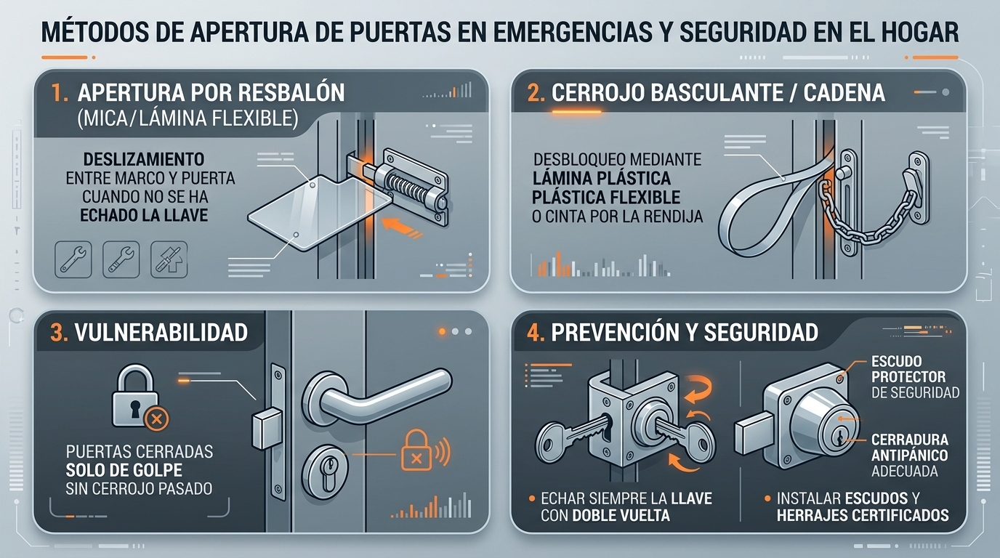

---
tags:
  - utilidades
  - bricolaje
  - seguridad
---

# Cómo abren los bomberos puertas cerradas en segundos: Técnicas de emergencia y seguridad en el hogar

En situaciones de emergencia médica, conatos de incendio o personas atrapadas en una vivienda, cada segundo cuenta. Antes de recurrir a herramientas destructivas pesadas como el ariete o la palanca Halligan, los equipos de bomberos y cuerpos de rescate emplean **técnicas de apertura no destructiva (*bypass*)** capaces de franquear puertas en cuestión de un segundo.

Comprender el funcionamiento de estas técnicas no solo es útil en situaciones de contingencia, sino que revela las principales vulnerabilidades de las cerraduras domésticas y cómo proteger tu hogar adecuadamente.

---

## 📊 Infografía resumen: Métodos de apertura y prevención

---

## 📹 Vídeo demostrativo

<video controls preload="metadata" style="max-width:100%;border:1px solid #ccc;border-radius:8px;margin:.5rem 0;" src="../video/apertura-puertas-emergencia-bomberos.mp4"></video>

*Demostración práctica: apertura de resbalones y cerrojos basculantes con láminas flexibles de cerrajería.*

---

## ¿Cómo funcionan estas técnicas de apertura rápida?

### 1. Apertura por resbalón con lámina plástica o fleje (*Mica*)
Cuando una puerta se cierra «de golpe» sin echar la llave, el único elemento que la mantiene cerrada es el **resbalón biselado** accionado por un muelle interior.

- **El método:** Se introduce una lámina plástica flexible (mica de cerrajero) o una herramienta metálica fina (*shove knife*) a través de la holgura entre la puerta y el marco.
- **El mecanismo:** Al deslizar la lámina contra la cara inclinada del resbalón, la presión comprime el muelle hacia adentro, liberando el pestillo al instante sin provocar ningún daño.

### 2. Desbloqueo de cerrojos basculantes y cadenas de retención
Muchas puertas cuentan con pestillos basculantes de seguridad (típicos de hoteles) o cadenas que permiten abrir la puerta unos centímetros para comprobar quién está fuera.

- **La vulnerabilidad:** La holgura que deja la puerta entreabierta es suficiente para pasar una lámina plástica flexible o una cinta.
- **La maniobra:** Pasando la lámina por detrás del brazo basculante y tirando hacia el marco, se abate el pasador metálico a su posición de apertura en segundos desde el exterior.

---

## La regla de oro de la seguridad en el hogar

El vídeo evidencia un fallo de seguridad muy extendido: **creer que una puerta cerrada de golpe está protegida**.

| Estado de la puerta | Resistencia frente a lámina/mica | Seguridad real |
| :--- | :--- | :--- |
| **Cerrada de golpe (sin llave)** | Se abre en **1 segundo** sin ruido ni daños. | ❌ Nula |
| **Pestillo basculante / Cadena** | Se desbloquea en **segundos** por la rendija. | ❌ Muy baja |
| **Cerrada con llave (doble vuelta)** | El cerrojo macizo queda anclado en el marco. | ✅ Alta |

---

## Medidas preventivas para blindar tu puerta

1. **Echar siempre la llave con doble vuelta:** Al girar la llave, se proyecta el cerrojo cuadrado macizo (*deadbolt*), que no tiene bisel y resulta totalmente inmune a tarjetas o láminas.
2. **Instalar cerraduras con pestillo de bloqueo auxiliar (*deadlatch*):** Tienen un pequeño pasador cilíndrico junto al resbalón que, al quedar presionado contra el marco, impide que el resbalón principal se retraiga desde fuera.
3. **Escudos protectores y pletinas antitarjeta:** Colocar una pletina metálica en «L» o un protector de marco que tape el espacio entre puerta y marco, impidiendo el paso de cualquier lámina.
