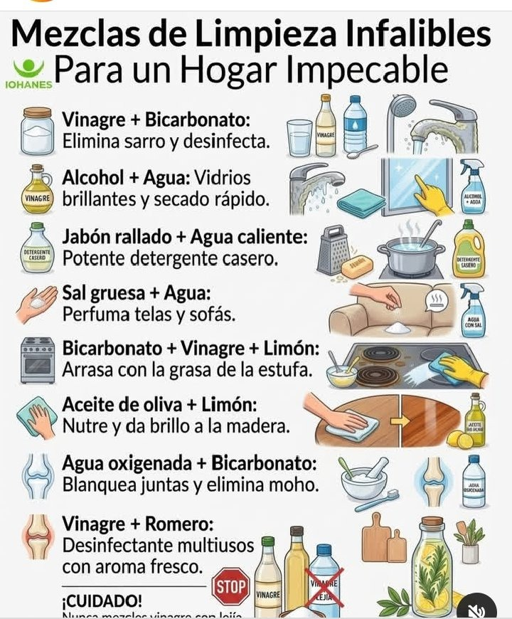

---
tags:
  - utilidades
  - limpieza
  - hogar
---

# Mezclas de limpieza infalibles para un hogar impecable

Guía práctica de fórmulas y soluciones caseras eficaces para limpiar, desinfectar y mantener las superficies del hogar utilizando ingredientes cotidianos y económicos.

---

## 🧽 Guía visual

---

## Las 8 mezclas y sus usos

1. **Vinagre + Bicarbonato**: Elimina el sarro, la cal acumulada y desinfecta griferías y sanitarios.
2. **Alcohol + Agua**: Deja vidrios y cristales brillantes con un secado instantáneo sin marcas.
3. **Jabón rallado + Agua caliente**: Potente detergente casero desengrasante para vajilla, ollas o limpieza general.
4. **Sal gruesa + Agua**: Neutraliza malos olores y refresca sofás, telas y tapicerías.
5. **Bicarbonato + Vinagre + Limón**: Desincrusta la grasa quemada y acumulada en fogones, estufas y hornos.
6. **Aceite de oliva + Limón**: Nutre la madera en profundidad, evita la sequedad y devuelve el brillo natural.
7. **Agua oxigenada + Bicarbonato**: Blanquea las juntas de azulejos y elimina manchas de humedad y moho.
8. **Vinagre + Romero**: Desinfectante natural multiusos con agradable fragancia herbal y fresca.

---

!!! danger "¡Regla de oro de seguridad!"
    **Nunca mezcles vinagre (u otros ácidos) con lejía (cloro):** esta reacción química libera gas cloro, que es altamente tóxico e irritante para las vías respiratorias y los ojos.
