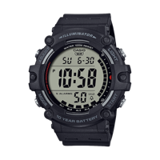
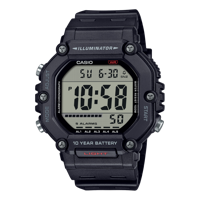
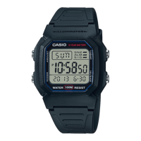
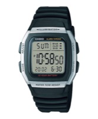
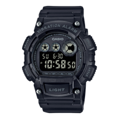
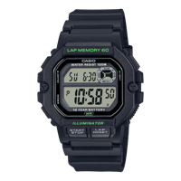
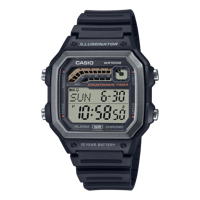
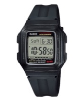
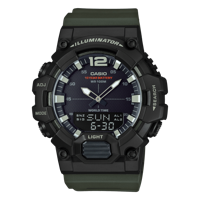
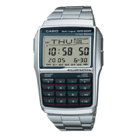

# Relojes Casio con 10 años de batería

Comparativa de modelos Casio con pila de larga duración (más de 10 años de autonomía). Datos oficiales de Casio España.

| Modelo | Foto | Familia | Pila | Resistencia | Materiales | Funciones | Precio |
|--------|------|---------|------|-------------|------------|-----------|--------|
| AE-1500WH-1AV | { width=80 } | Timeless Collection | CR2032 (Litio) | 10 bar / 100 m | Resina sintética (57 g) | Pantalla de dígitos gigantes, hora dual, 5 alarmas | 39,90 € |
| AE-1600H-1AV | { width=80 } | Timeless Collection | CR2032 (Litio) | 10 bar / 100 m | Resina sintética (52 g) | Caja angular robusta, cronógrafo, 5 alarmas | 39,90 € |
| W-800H-1AV | { width=80 } | Digital Estándar | CR2025 (Litio) | 10 bar / 100 m | Resina sintética (37 g) | Pantalla multizona, hora dual, luz LED | ~29,90 € |
| W-96H-1AV | { width=80 } | Digital Estándar | CR2025 (Litio) | 5 bar / 50 m | Resina sintética (32 g) | Formato curvado ergonómico, hora dual | ~29,90 € |
| W-735H-1BV | { width=80 } | Estándar Técnico | CR2032 (Litio) | 10 bar / 100 m | Resina sintética (43-50 g) | Alarma por vibración silenciosa, LED | 49,90 € |
| WS-1400H-1AV | { width=80 } | Sports Series | CR2025 (Litio) | 10 bar / 100 m | Resina sintética (43 g) | Memoria de 60 vueltas, botón frontal crono | 39,90 € |
| WS-1600H-1AV | { width=80 } | Sports Series | CR2025 (Litio) | 10 bar / 100 m | Resina sintética (39 g) | Temporizadores de intervalos múltiples (hasta 9) | 39,90 € |
| F-201WA-1A | { width=80 } | Clásico Entrada | CR2025 (Litio) | Water Resistant | Resina sintética (23,5 g) | 5 alarmas multifunción, cronómetro 24 h | ~24,90 € |
| HDC-700-3AV | { width=80 } | Híbrido Ana-Digi | CR2025 (Litio) | 10 bar / 5 bar | Resina sintética (34-49 g) | Telememo (30 contactos), hora mundial | 39,90 € - 59,90 € |
| DBC-32-1AV | { width=80 } | Vintage Data Bank | CR2025 (Litio) | Water Resistant | Resina sintética (34 g) | Teclado numérico de 10 teclas, calculadora | 49,90 € |

Enlaces a la web oficial de Casio en cada modelo: [AE-1500WH](https://www.casio.com/es/watches/casio/product.AE-1500WH-1AV/), [AE-1600H](https://www.casio.com/es/watches/casio/product.AE-1600H-1AV/), [W-800H](https://www.casio.com/es/watches/casio/product.W-800H-1AV/), [W-96H](https://www.casio.com/es/watches/casio/product.W-96H-1AV/), [W-735H](https://www.casio.com/es/watches/casio/product.W-735H-1BV/), [WS-1400H](https://www.casio.com/es/watches/casio/product.WS-1400H-1AV/), [WS-1600H](https://www.casio.com/es/watches/casio/product.WS-1600H-1AV/), [F-201WA](https://www.casio.com/es/watches/casio/product.F-201WA-1A/), [HDC-700](https://www.casio.com/es/watches/casio/product.HDC-700-3AV/), [DBC-32](https://www.casio.com/es/watches/casio/vintage/product.DBC-32D-1A/).
