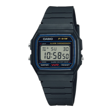
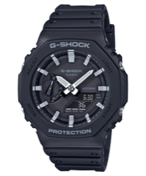
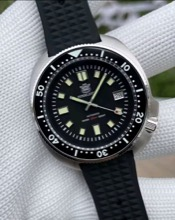
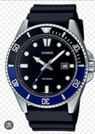
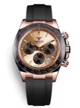
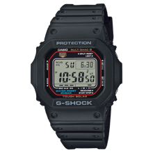
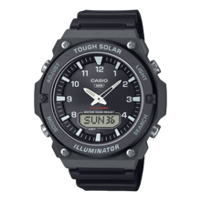
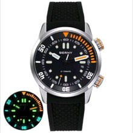

# Relojes para comprar

Lista de modelos a considerar. Las casillas se marcan ✅ cuando se compra/decide (pulsa la casilla para marcarla).

## Por decidir / comprar

- [ ] **Casio F-91W** — clásico digital barato y fiable.
- [ ] **G-Shock GA2100** — resistente, estilo "Casi-Casi" (Casioak).
- [ ] **SteelDive Capitán Willard** — sumergible estilo militar (AliExpress).
- [ ] **Casio Marlín** — automático clásico de entrada (MDV-107).
- [ ] **Reloj de lujo VK63** — cronógrafo de negocios, cuarzo, 39mm, acero/oro rosa, fecha, esfera luminosa, cronógrafo completo (AliExpress).
- [ ] **Casio G-Shock GW-M5610 Solar** — digital resistente (200 m), módulo Tough Solar y sincronización atómica Multi Band 6. Rango ~105–139 €.
- [ ] **Casio AQ-S820W-1AV Solar** — deportivo digital de resina (100 m), módulo Tough Solar y sin Bluetooth. ~59,90 €.
- [ ] **Berny Compressor** — reloj de buceo automático estilo "compressor" (inspirado en Longines Polaris), movimiento Seagull ST1632 o Miyota 8215. ~130–140 € (AliExpress).

> 📌 **Relojes Casio con 10 años de batería:** comparativa de 10 modelos Casio de larga duración → [ver artículo](relojes-casio-10-anos-bateria.md)

## Imágenes

| Modelo | Foto |
|--------|------|
| Casio F-91W | { width=120 } |
| G-Shock GA2100 | { width=120 } |
| SteelDive Capitán Willard | { width=120 } |
| Casio Marlín | { width=120 } |
| Reloj de lujo VK63 | { width=120 } |
| Casio G-Shock GW-M5610 Solar | { width=120 } |
| Casio AQ-S820W-1AV Solar | { width=120 } |
| Berny Compressor | { width=120 } |

## Notas

- SteelDive es marca de réplica de buena calidad, no original.
