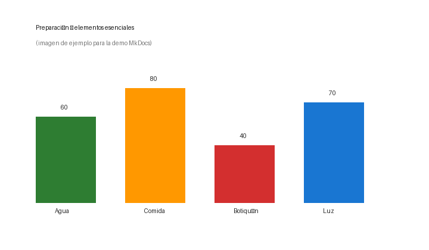

# Artículo de ejemplo (formato)

Esto muestra todo lo que se puede hacer en un artículo de MkDocs: **negrita**, *cursiva*, `código`, tablas, avisos, imágenes y vídeos.

## Tabla

| Elemento | Uso | Cantidad recomendada |
|----------|-----|----------------------|
| Agua | Hidratación | 2 litros/día |
| Comida | Energía | 2000 kcal/día |
| Botiquín | Primeros auxilios | 1 completo |
| Linterna | Iluminación | 1 con pilas de repuesto |

## Avisos (admonitions)

!!! note "Nota"
    Esto es una nota informativa. Se usa para aclaraciones.

!!! tip "Consejo"
    Esto es un consejo práctico. Útil para recomendaciones.

!!! warning "Atención"
    Esto es una advertencia. Úsala para precauciones.

!!! danger "Peligro"
    Esto es un peligro. Úsala para riesgos serios.

## Imagen

## Vídeo

<video controls preload="none" src="../video/salud-dolor-rodilla.mp4">Vídeo de ejemplo</video>
